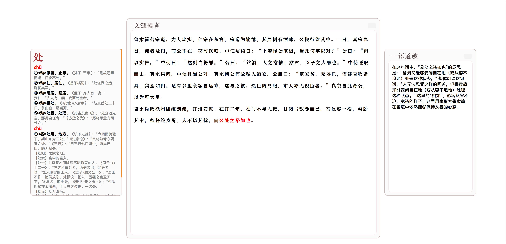

# ClassiTrans
## Introduce
文言文翻译工具，可以直接对文言文进行选词翻译  
使用 Qwen-7B 进行AI辅助翻译  
## Instruction

此图片为使用界面    
> ### 文筵韫言
>> 点击右上角的按钮可以编辑内容  
>> 再按一次既确定  
>> 你可以通过点击字来确定翻译内容（变红既表示确定）
>> 再次点击红字可以取消
> ### 一语道破
>> 点击右上角的按钮可以使AI翻译红字选中内容  
>> Qwen-7B提供翻译支持  
>> 或者按下空格也可以启动AI翻译
> ### 说文解字
>> 即最左边的方框  
>> 按下空格既可以进行翻译  
>> 一次仅展示一个字，按下键盘的箭头左右键可以切换单子  
>> 翻译来源 https://wyw.hwxnet.com/
## Run
运行`server.py`开启本地服务器  
再使用npm的http-server开启网页服务器  
`http-server -a 127.0.0.1 -p 8081`